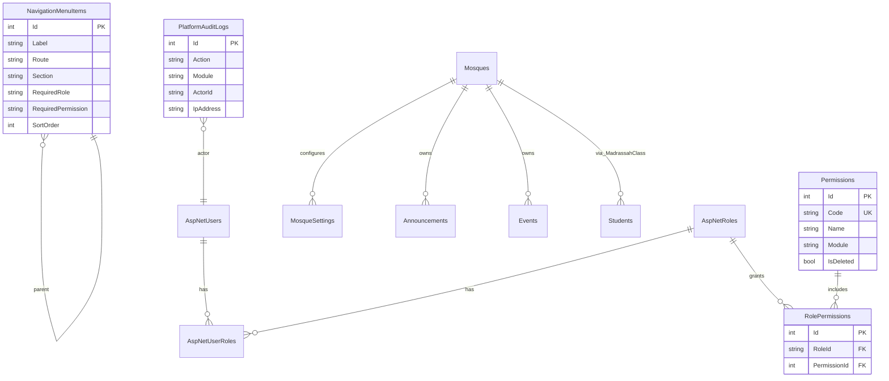

# MosqueOS Enterprise Platform

Enterprise architecture reference for MosqueOS — SQL Server, ASP.NET Core, Angular, RBAC, audit, and dynamic navigation.

## Stack

| Layer | Technology | Notes |
|-------|------------|-------|
| Frontend | Angular 17+ (upgrade path to 18) | Lazy routes, RxJS, route guards, dynamic sidebar |
| UI | Tailwind + Angular Material 17 | Material wired via `provideAnimationsAsync()` |
| Backend | ASP.NET Core (.NET 10) | JWT, Identity, EF Core |
| Database | SQL Server Express (`mos_db`) | Code First migrations |
| Patterns | Clean Architecture, Repository, Service Layer | `API → Application → Domain ← Infrastructure` |

## Role Hierarchy

1. Super Admin — full platform
2. Mosque Owner — single mosque, all operations
3. Mosque Admin — assigned mosque operations
4. Prayer Times Editor
5. Teacher
6. Parent
7. Member
8. Muqaddam
9. Content Editor

## ERD (Core + RBAC)



## RBAC Tables

| Table | Purpose |
|-------|---------|
| `AspNetUsers` | Users (Identity) |
| `AspNetRoles` | Roles |
| `AspNetUserRoles` | User ↔ Role |
| `Permissions` | Granular permission codes |
| `RolePermissions` | Role ↔ Permission |
| `NavigationMenuItems` | Database-driven sidebar |

### Permission codes (seeded)

- `platform.full`, `platform.mosques.manage`, `platform.users.manage`, `platform.claims.approve`
- `mosque.profile.manage`, `mosque.staff.manage`, `mosque.prayer.manage`, `mosque.reports.view`
- See `EnterpriseSeeder.cs` for full list

## Soft Deletes

All `BaseEntity` types include:

- `IsDeleted`, `DeletedAt`, `DeletedById`
- Global EF query filter: `WHERE IsDeleted = 0`
- `Repository.Remove()` performs soft delete

## Audit Logging

`PlatformAuditLogs` tracks:

- User (`ActorId`, `ActorName`)
- Action, Module
- Target type/id
- IP address
- Timestamp

Service: `IAuditService` → `AuditService`

## Service Layer

| Interface | Implementation | Responsibility |
|-----------|----------------|----------------|
| `INavigationService` | `NavigationService` | Dynamic sidebar by role/permission |
| `IPermissionService` | `PermissionService` | Resolve permissions from roles |
| `IAuditService` | `AuditService` | Write audit entries |
| `IUnitOfWork` | `UnitOfWork` | Repository + SaveChanges |

## API Endpoints (Enterprise)

| Method | Route | Description |
|--------|-------|-------------|
| GET | `/api/v1/navigation` | Roles, permissions, menu (JWT) |
| GET | `/api/v1/auth/me` | Profile + permissions |
| GET | `/api/v1/platform/dashboard` | Super Admin KPIs |
| GET | `/api/v1/mosques/{id}/admin/dashboard` | Mosque Admin KPIs |

## Angular Structure

```
frontend/src/app/
├── core/
│   ├── auth/          # guards, interceptor, has-permission directive
│   ├── config/        # static nav fallbacks
│   └── services/      # navigation.service, platform, admin
├── modules/
│   ├── super/         # super.routes.ts (lazy)
│   ├── owner/         # owner.routes.ts (lazy)
│   ├── admin/         # admin.routes.ts (lazy)
│   └── member/        # worship modules
└── layout/shell/      # dynamic sidebar from API
```

## Lazy Loading

- `/dashboard/super/*` → `super.routes.ts`
- `/dashboard/owner/*` → `owner.routes.ts`
- `/dashboard/admin/*` → `admin.routes.ts`

## Dynamic Sidebar

1. Login → `GET /api/v1/navigation`
2. `NavigationService` stores sections + permissions
3. `ShellComponent` renders DB menu (fallback: static config)

## Permission-Based UI

```html
<button *appHasPermission="'platform.users.manage'">Manage Users</button>
```

## Indexes (recommended)

- `Permissions.Code` (unique)
- `RolePermissions(RoleId, PermissionId)` (unique)
- `NavigationMenuItems(Section, Route, RequiredRole)`
- `Mosques.Slug` (unique)
- `PrayerTimesDaily(MosqueId, Date)` (unique)

## Migration

After pulling changes:

```powershell
cd MosqueOS\backend\MosqueOS.API
dotnet ef migrations add EnterpriseRbacNavigationSoftDelete --project ..\MosqueOS.Infrastructure
dotnet ef database update
```

Or restart API — `DataSeeder` runs `MigrateAsync()` on startup.

## Demo Accounts

| User | Password | Role |
|------|----------|------|
| admin | Admin@123 | Super Admin |
| owner | Owner@123 | Mosque Owner |
| mosqueadmin | Mosque@123 | Mosque Admin |
| member | Member@123 | Member |

## Remaining Enterprise Items (roadmap)

- Angular 18 upgrade
- Full Material theming on all CRUD screens
- PDF/Excel export libraries
- File upload (logo, banner, content library)
- Claims document upload workflow
- Pagination component on all list APIs
- Permission policy on every controller action
