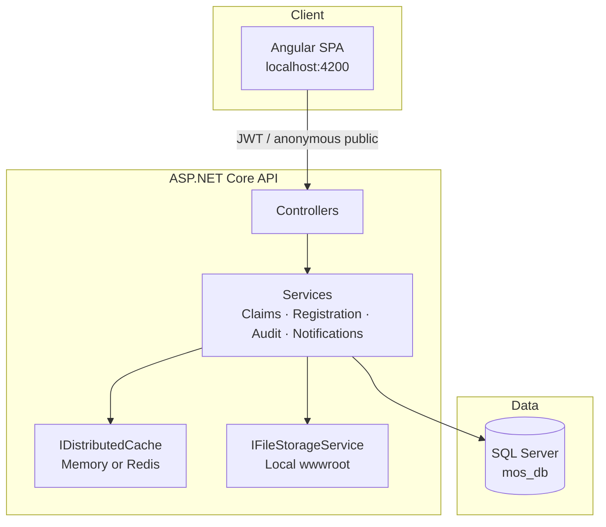
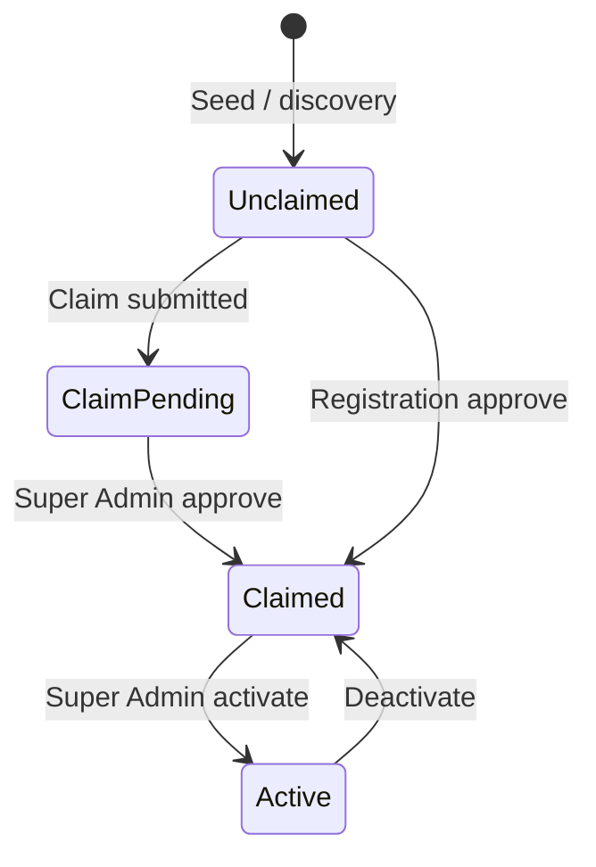
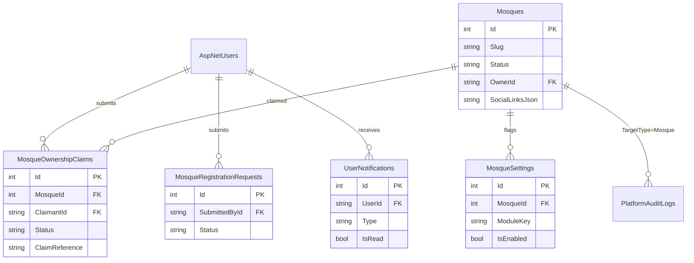

# Module 3.1 — Architecture & ERD

## System architecture

## Status lifecycle

## Core ERD (Module 3.1)

## Production notes (Milestone 9)

| Concern | Implementation |
|---------|----------------|
| Public profile latency | `MosquePublicProfileCache` (60s TTL) + `Cache-Control` |
| Redis | Set `ConnectionStrings:Redis`; otherwise in-memory distributed cache |
| Claim abuse | Rate limit policy `claim-submit` — 5/hour/user |
| Media | `IFileStorageService` → local `wwwroot/uploads`; Azure via future SDK |
| SEO | Client meta/OG/canonical on public profile; full Angular SSR deferred |
